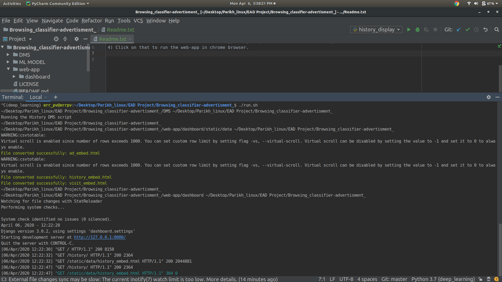
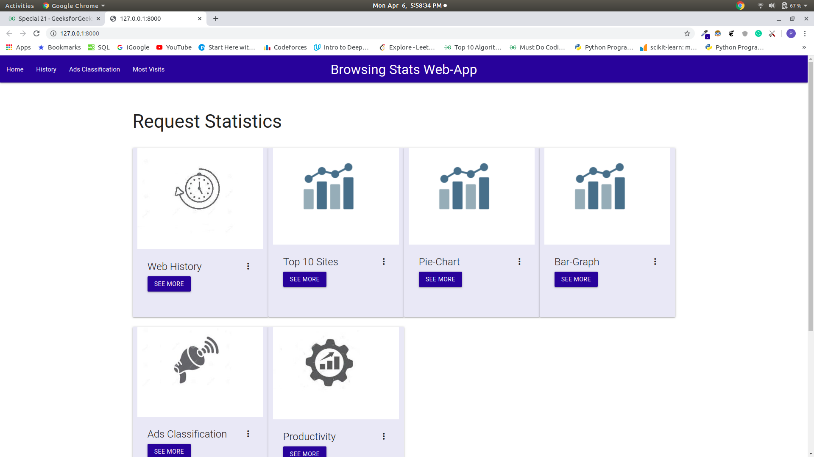
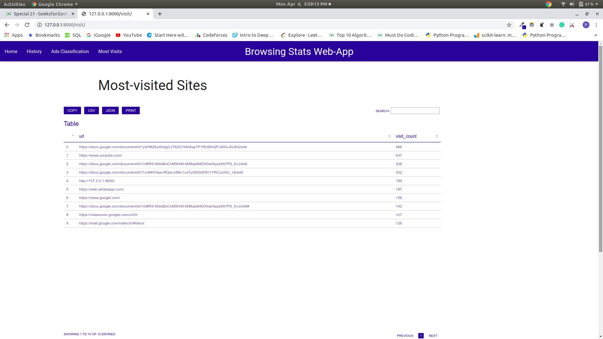
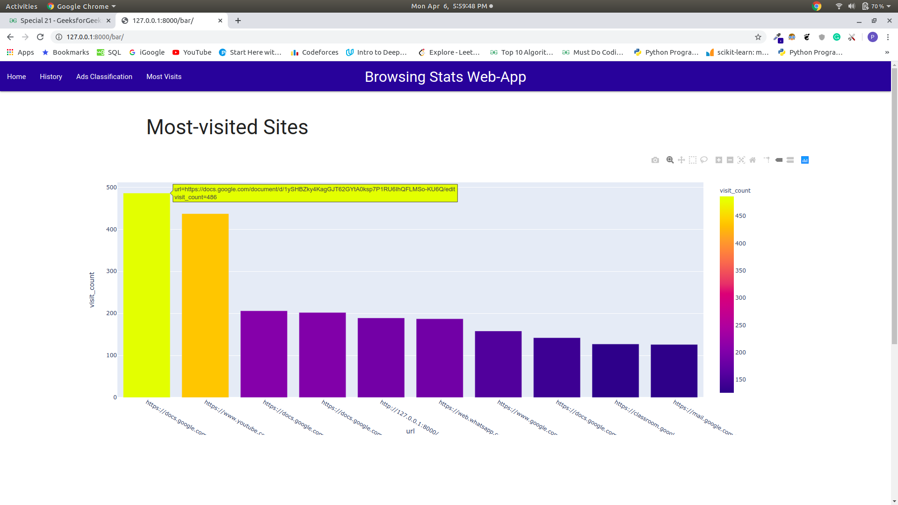

# Browsing_classifier-advertisment_
Chrome History Stastical Classifier and Client based advertisement model
This information system is designed to run on a linux operating system.
To run this:
1) Open terminal in the Browsing_classifier-advertisment_ directory. (The application will itslef install all the requirements)
2) Run command ./run.sh.
3) After DMS script runs and executes a url (typically http://127.0.0.1:8000/) will appear.
4) Click on that to run the web-app in chrome browser.

